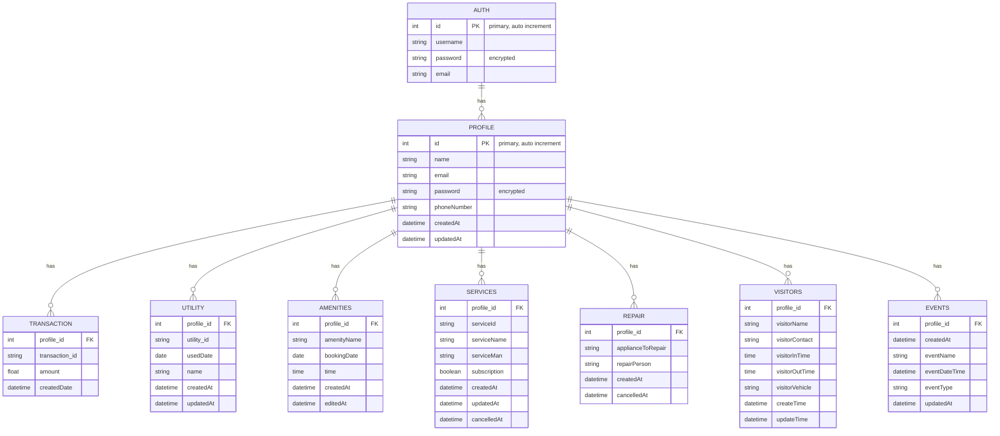

# Residentron-Backend

This is the backend for the Residentron project, an integrated housing society app for managing users and community-related activities.

## Features

- User authentication (registration, login, logout)
- Profile management (create, update, delete)
- Transaction management
- Utility management
- Amenity booking
- Service subscription
- Repair service request
- Visitor management
- Event scheduling

## Getting Started

These instructions will help you set up and run the Residentron-Backend on your local machine for development and testing purposes.

### Prerequisites

- [Node.js](https://nodejs.org/) installed
- yarn installed

### Installing

1. Clone the repository:

    ```bash
    git clone https://github.com/Naveen-g09/Residentron-Backend.git
    cd Residentron-Backend
    ```

2. Install dependencies:

    ```bash
    npm install
    ```

3. [Additional steps, if any]

### Running

Start the server:

```bash
npm start
```

### Tech Stack

1. Postgres
2. Express
3. DAPR
4. OPENAI
5. Docker
6. AWS

### DB DESIGN

---



---

## APIS

---

- Welcome Message: residentron/
- Authentication Endpoints:
  - POST: residentron/auth
  - GET (by username): residentron/auth/:username
  - GET (by email): residentron/auth/email/:email
  - PUT: residentron/auth/:username
  - DELETE: residentron/auth/:username
- Profile Endpoints:
  - POST: residentron/profile
  - GET (by email): residentron/profile/:email
  - GET (by id): residentron/profile/id/:id
  - PUT: residentron/profile/:id
  - DELETE: residentron/profile/:id
- Transaction Endpoints:
  - POST: residentron/transaction
  - GET (by profileId): residentron/transaction/:profileId
  - PUT: residentron/transaction/:transactionId
  - DELETE: residentron/transaction/:transactionId
- Utility Endpoints:
  - POST: residentron/utility
  - GET (by profileId): residentron/utility/:profileId
  - PUT: residentron/utility/:utilityId
  - DELETE: residentron/utility/:utilityId
- Amenity Endpoints:
  - POST: residentron/amenity
  - GET (by profileId): residentron/amenity/:profileId
  - PUT: residentron/amenity/:amenityId
  - DELETE: residentron/amenity/:amenityId
- Service Endpoints:
  - POST: residentron/service
  - GET (by profileId): residentron/service/:profileId
  - PUT: residentron/service/:serviceId
  - DELETE: residentron/service/:serviceId
- Repair Endpoints:
  - POST: residentron/repair
  - GET (by profileId): https://96b5-103-136-175-206

.ngrok-free.app/repair/:profileId
  - PUT: residentron/repair/:repairId
  - DELETE: residentron/repair/:repairId
- Visitor Endpoints:
  - POST: residentron/visitor
  - GET (by profileId): residentron/visitor/:profileId
  - PUT: residentron/visitor/:visitorId
  - DELETE: residentron/visitor/:visitorId
- Events Endpoints:
  - POST: residentron/events
  - GET (by profileId): residentron/events/:profileId
  - PUT: residentron/events/:eventId
  - DELETE: residentron/events/:eventId
```

### Wing A Endpoints:

1. **Create a Wing A Record**
   - **Description:** Creates a new record for Wing A.
   - **Method:** `POST`
   - **URL:** `/varsha_a`
   - **Body Parameters:**
     - `roomNumber` (string): Room number of the record.
     - `name` (string): Name associated with the record.
     - `ownershipType` (string): Type of ownership.
     - `parking` (boolean): Availability of parking.
   - **Response:** JSON object representing the newly created record.

2. **Get Wing A Record by ID**
   - **Description:** Retrieves a Wing A record by its ID.
   - **Method:** `GET`
   - **URL:** `/varsha_a/:id`
   - **URL Parameters:**
     - `id` (string): ID of the record to retrieve.
   - **Response:** JSON object representing the requested record.

3. **Get Wing A Record by Room Number**
   - **Description:** Retrieves Wing A records by room number.
   - **Method:** `GET`
   - **URL:** `/varsha_a/room/:roomNumber`
   - **URL Parameters:**
     - `roomNumber` (string): Room number to search for.
   - **Response:** JSON array of records matching the room number.

4. **Get Wing A Record by Name**
   - **Description:** Retrieves Wing A records by name.
   - **Method:** `GET`
   - **URL:** `/varsha_a/name/:name`
   - **URL Parameters:**
     - `name` (string): Name to search for.
   - **Response:** JSON array of records matching the name.

5. **Get Wing A Record by Ownership Type**
   - **Description:** Retrieves Wing A records by ownership type.
   - **Method:** `GET`
   - **URL:** `/varsha_a/ownership/:ownershipType`
   - **URL Parameters:**
     - `ownershipType` (string): Type of ownership to filter by.
   - **Response:** JSON array of records matching the ownership type.

6. **Get All Wing A Records**
   - **Description:** Retrieves all Wing A records.
   - **Method:** `GET`
   - **URL:** `/varsha_a`
   - **Response:** JSON array of all Wing A records.

7. **Update Wing A Record**
   - **Description:** Updates an existing Wing A record.
   - **Method:** `PUT`
   - **URL:** `/varsha_a/:id`
   - **URL Parameters:**
     - `id` (string): ID of the record to update.
   - **Body Parameters:**
     - Same as in "Create a Wing A Record" endpoint.
   - **Response:** JSON object representing the updated record.

8. **Delete Wing A Record**
   - **Description:** Deletes a Wing A record.
   - **Method:** `DELETE`
   - **URL:** `/varsha_a/:id`
   - **URL Parameters:**
     - `id` (string): ID of the record to delete.
   - **Response:** JSON object confirming the deletion.

### Wing B, C, and D Endpoints:

The endpoints for wings B, C, and D follow the same structure as those for Wing A, with the only difference being the base URL path. Replace `/varsha_a` in the above endpoint URLs with `/b`, `/c`, or `/d` respectively for wings B, C, or D.

### Disclaimer:

Replace `residentron/` with the actual URL where your backend server is hosted.
In the place of residentron use this url: https://96b5-103-136-175-206.ngrok-free.app


Sure, here are the links directly to each endpoint:

### Wing A Endpoints:

1. **Create a Wing A Record**
   - **Method:** `POST`
   - **URL:** [localhost/a](http://localhost/a)
   
2. **Get Wing A Record by ID**
   - **Method:** `GET`
   - **URL:** [localhost/a/:id](http://localhost/a/:id)
   
3. **Get Wing A Record by Room Number**
   - **Method:** `GET`
   - **URL:** [localhost/a/room/:roomNumber](http://localhost/a/room/:roomNumber)
   
4. **Get Wing A Record by Name**
   - **Method:** `GET`
   - **URL:** [localhost/a/name/:name](http://localhost/a/name/:name)
   
5. **Get Wing A Record by Ownership Type**
   - **Method:** `GET`
   - **URL:** [localhost/a/ownership/:ownershipType](http://localhost/a/ownership/:ownershipType)
   
6. **Get All Wing A Records**
   - **Method:** `GET`
   - **URL:** [localhost/a](http://localhost/a)
   
7. **Update Wing A Record**
   - **Method:** `PUT`
   - **URL:** [localhost/a/:id](http://localhost/a/:id)
   
8. **Delete Wing A Record**
   - **Method:** `DELETE`
   - **URL:** [localhost/a/:id](http://localhost/a/:id)

### Wing B Endpoints:

Replace `/varsha_a` with `/varsha_b` in the above URLs for Wing B.

### Wing C Endpoints:

Replace `/varsha_a` with `/varsha_c` in the above URLs for Wing C.

### Wing D Endpoints:

Replace `/varsha_a` with `/varsha_d` in the above URLs for Wing D.

### Disclaimer:

Please replace `localhost` in the URLs provided above with the actual secret URL provided for accessing the application.