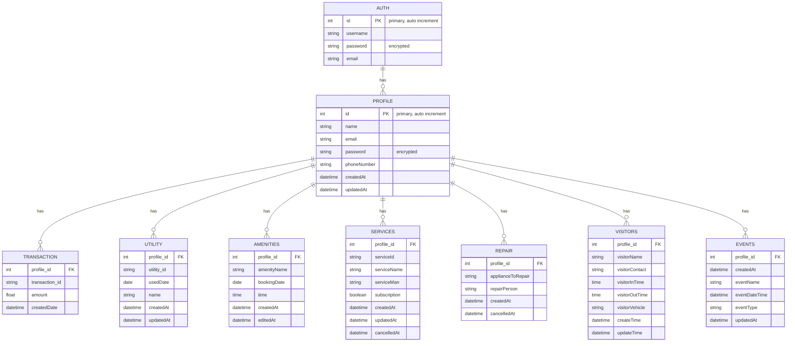

# Residentron-Backend

This is the backend for the Residentron project, an integrated housing society app for managing users and community-related activities.

## Features

-
- ...

## Getting Started

These instructions will help you set up and run the Residentron-Backend on your local machine for development and testing purposes.

### Prerequisites

- [Node.js](https://nodejs.org/) installed
- yarn installed

### Installing

1. Clone the repository:

    ```bash
    git clone https://github.com/Naveen-g09/Residentron-Backend.git
    cd Residentron-Backend
    ```

2. Install dependencies:

    ```bash
    npm install
    ```

3. [Additional steps, if any]

### Running

Start the server:

```bash
npm start

### Tech Stack(Probably)
1. Postgres
2. Express
3. DAPR
4. OPENAI
5. Docker
6. AWS

### DB DESIGN

---


---


---

APIS

---

- Welcome Message: http://localhost/
- Authentication Endpoints:
  - POST: http://localhost/auth
  - GET (by username): http://localhost/auth/:username
  - GET (by email): http://localhost/auth/email/:email
  - PUT: http://localhost/auth/:username
  - DELETE: http://localhost/auth/:username
- Profile Endpoints:
  - POST: http://localhost/profile
  - GET (by email): http://localhost/profile/:email
  - GET (by id): http://localhost/profile/id/:id
  - PUT: http://localhost/profile/:id
  - DELETE: http://localhost/profile/:id
- Transaction Endpoints:
  - POST: http://localhost/transaction
  - GET (by profileId): http://localhost/transaction/:profileId
  - PUT: http://localhost/transaction/:transactionId
  - DELETE: http://localhost/transaction/:transactionId
- Utility Endpoints:
  - POST: http://localhost/utility
  - GET (by profileId): http://localhost/utility/:profileId
  - PUT: http://localhost/utility/:utilityId
  - DELETE: http://localhost/utility/:utilityId
- Amenity Endpoints:
  - POST: http://localhost/amenity
  - GET (by profileId): http://localhost/amenity/:profileId
  - PUT: http://localhost/amenity/:amenityId
  - DELETE: http://localhost/amenity/:amenityId
- Service Endpoints:
  - POST: http://localhost/service
  - GET (by profileId): http://localhost/service/:profileId
  - PUT: http://localhost/service/:serviceId
  - DELETE: http://localhost/service/:serviceId
- Repair Endpoints:
  - POST: http://localhost/repair
  - GET (by profileId): http://localhost/repair/:profileId
  - PUT: http://localhost/repair/:repairId
  - DELETE: http://localhost/repair/:repairId
- Visitor Endpoints:
  - POST: http://localhost/visitor
  - GET (by profileId): http://localhost/visitor/:profileId
  - PUT: http://localhost/visitor/:visitorId
  - DELETE: http://localhost/visitor/:visitorId
- Events Endpoints:
  - POST: http://localhost/events
  - GET (by profileId): http://localhost/events/:profileId
  - PUT: http://localhost/events/:eventId
  - DELETE: http://localhost/events/:eventId


in the place of  lcoalhost use this url: https://96b5-103-136-175-206.ngrok-free.app/

